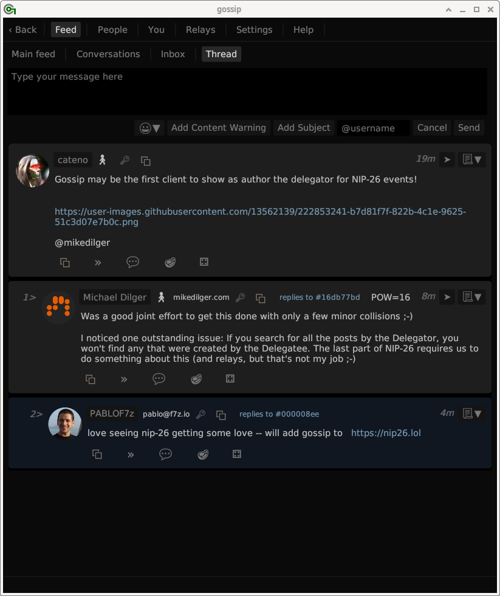

# Gossip

Gossip is a desktop client for nostr.

Nostr is a social media protocol and ecosystem, kind of like Twitter [^1] except that you control your own account and nobody can silence you so long as some relay operator somewhere allows you to post. People are finding many additional uses for nostr that go far beyond just chatting, but this client is focused on chatting.

Nostr stands for "Notes and Other Stuff Transmitted by Relays."

[^1] and Mastodon, Gab, Post, Gettr, Farcaster, Truth social, BlueSky, Locals, Minds, Spoutable, etc, etc....

### Points of Difference

The following features make gossip different than most other nostr clients so far:

- Gossip follows people wherever they post, dynamically detects where events might be, and dynamically connects, subscribes, and disconnects to various relays as needed to get those events.
- Gossip handles private keys securely.
- Gossip avoids complex HTML/CSS/JavaScript web rendering, preferring to render with OpenGL (or similar), and also avoids web fetch technologies, preferring to use simple HTTP GETs and WebSocket upgrade. This avoids web security issues like XSS vulnerabilities, JavaScript attack vectors, CORS issues, cookie issues, etc, etc. The downside is that it isn't as pretty as web-based clients.

## Status

Gossip is currently alpha-quality code. Given most nostr clients are also alpha quality code, I no longer recommend against its usage. Feel free to use it as it is, just be aware that there are still serious shortcomings.

Also, the GUI sucks. It looks horrible. And isn't smartly designed. But form follows function, and only after the function is sufficiently complete will I work on the GUI.

### Missing Critical Features

- [ ] Making it much easier to get started
- [ ] Setting your metadata and syncing it with the network.
- [ ] Syncing the relays you use with the network
- [ ] Encrypted Private Messaging
- [ ] Choosing to hide replies (anybody can reply so they can be spammy)
- [ ] Muting people

## Getting Started

**Gossip is HARD to get started** because there is no way to tell it a set of relays to pull from, and right from the start it doesn't have enough data to figure out what to do. You can however do this to get it started:

- On page `You`, add your key (public or private)
- On page `Relays` add a relay that you post to (or several), and tick off "Post Here" (otherwise it won't pull your data from there). Remember to press "SAVE CHANGES" at the bottom of that page.
- On page `People > Follow Someone New` follow yourself (specify your public key AND one of the relays you added in the previous step. If you don't add the relay, gossip can't help you).
- Restart (sorry this will be fixed one of these days)
- On page `Feed > Following ` look at your posts (by default only the last 12 hours show up) and their replies (by clicking the right arrow on the right side of post to give the thread), which will give gossip some data to launch from. Hopefully you have some replies. But if not, no worry, the next step helps too.
- On page `People > Followed` press `Pull Overwrite` to pull down the people you follow. You can then press `Refresh Metadata` to get their metadata (whether it works or not depends on if gossip knows which relays these people are at yet).
- Click any of these people's avatars and press `View Their Feed` to collect more data on where to find them. If you don't get any data for a person, it may be because there is no good way for nostr to know where they post to. This problem goes away after using gossip for awhile, and it remains an outstanding issue to solve.
- Maybe restart again for good measure.

## Screenshot



## Development Ideology

- **High user control**: The plan is for the user to be in control of quite a lot of settings regarding which posts they see, which relays to talk to, and when to fetch from them, but with some sane defaults.
- **Key Security**: Private keys need to be handled as securely as possible. We store the key encrypted under a passphrase on disk, and we zero out any memory that has seen either the key or the password that decrypts it. We also keep the decrypted key in just one place, the Signer, which doesn't provide access to the key directly. Eventually we will look to add hardware token support, probably first using programmable [Solo keys](https://solokeys.com/) because I have a few of those.
- **Portable** design intended for the **desktop**: This is intended to run on desktop computers, but not limited as such. The platform must be supported by rust (most are), and SQLite3 needs to store its file somewhere. The UI will run on anything that runs one of these backends:
    - OpenGL (via glium or glow)
    - OpenGL ES (via glow or wgpu)
    - WebGL (via glow)
    - Vulkan (via wgpu)
    - Metal (via wgpu)
    - DirectX 11/12 (via wgpu)
    - Browsers (via WebAssembly)
- **High-enough performance**: Generally the network speed should be your limiting factor on performance, not the UI or any other part of the code. It doesn't matter too much how fast the code runs as long as it is always faster than the network, and I think that's definitely true for gossip.
- **Easy-ish on CPU/power usage**: We can't achieve this as well as other clients might because we use an immediate-mode renderer which necessarily recomputes what it draws every "frame" and may redraw many times per second. We are working hard to minimize the CPU impact of this hot loop. Try it and see.
- **Privacy Options**: in case someone wishes to remain secret they should use Gossip over Tor - I recommend using QubesOS do to this. But you could use Whonix or even Tails. Don't just do it on your normal OS which won't do Tor completely. Gossip will provide options to support privacy usage such as not loading avatars, having multiple identities, not necessarily sharing who you follow, etc.

### nostr features supported

We intend to support the following features/NIPs:

- [x] NIP-01 - Basic protocol flow description
- [x] NIP-02 - Contact List and Petnames
- [ ] NIP-04 - Encrypted Direct Message
- [x] NIP-05 - Mapping Nostr keys to DNS-based internet identifiers
- [x] NIP-08 - Handling Mentions
- [ ] NIP-09 - Event Deletion
- [x] NIP-10 - Conventions for clients' use of e and p tags in text events
- [x] NIP-11 - Relay Information Document
- [ ] NIP-12 - Generic Tag Queries
- [x] NIP-13 - Proof of Work
- [ ] NIP-14 - Subject tag in text events (partial)
- [x] NIP-15 - End of Stored Events Notice
- [ ] NIP-16 - Event Treatment
- [x] NIP-19 - bech32-encoded entities
- [x] NIP-20 - Command Results
- [ ] NIP-22 - Event created_at Limits
- [x] NIP-25 - Reactions
- [ ] NIP-26 - Delegated Event Signing
- [ ] NIP-28 - Public Chat
- [ ] NIP-33 - Parameterized Replaceable Events
- [ ] NIP-36 - Sensitive Content
- [ ] NIP-40 - Expiration Timestamp
- [ ] NIP-42 - Authentication of clients to relays

We do not intend to support the following features/NIPs:

- NIP-03 - OpenTimestamp Attestations for Events: We handle such events, but we do nothing about the ots fields in them.
- NIP-06 - Basic key derivation from mnemonic seed phrase. This is probably not applicable anyways.
- NIP-07 - window.nostr capability for web browsers. This is not applicable.

## Building and Installing

### Step 1 - Install Rust

If you don't already have rust installed, follow the guidance at [rust-lang.org](https://www.rust-lang.org/).

### Step 2 - Install some dependencies

Most dependencies are probably already installed in your base operating system. Here are a few that sometimes arent:

- build essentials like gcc and make (debian: "build-essential")
- cmake (debian: "cmake")
- pkg-config (debian: "pkg-config")
- openssl (debian: "libssl-dev")
- fontconfig (debian: "libfontconfig1-dev")

### Step 3 - Clone this Repository

````bash
$ git clone https://github.com/mikedilger/gossip
````

### Step 4 - Compile

````bash
$ cd gossip
$ cargo build --release
````

The output will be a binary executable in `target/release/gossip`

Everything gossip needs (fonts, icons) is baked into this executable. It doesn't need to find assets. So you can move it and run it from anywhere.

To make the binary smaller

````bash
$ strip gossip
````

This binary should be portable to similar systems with similar hardware and operating system.

If you want a binary optimized for your exact processor with the newest features enabled:

````bash
$ RUSTFLAGS="-C target-cpu=native --cfg tokio_unstable" cargo build --release
````

### Step 5 - Do it all again

The `master` branch changes quickly.  When you want to update

````bash
$ git pull
$ cargo build --release
$ strip ./target/release/gossip
$ ./target/release/gossip
````

## Technology Involved

- Rust Language
- egui Rust GUI framework
- SQLite 3
- Tungstenite websocket library
- Tokio async task runtime
- Serde serialization/deserialization
- Many others

## License

 * MIT license ([LICENSE-MIT](LICENSE-MIT) or http://opensource.org/licenses/MIT)

### Contribution

All contributions welcome.

Anyone interested in replacing the GUI with something much better, or keeping it as egui but making it much better, would be greatly appreciated.

Unless you explicitly state otherwise, any contribution intentionally submitted for inclusion in the work by you, shall be licensed as above, without any additional terms or conditions.

## Follow me on Nostr

My public key is ee11a5dff40c19a555f41fe42b48f00e618c91225622ae37b6c2bb67b76c4e49

You can also my NIP-05 address of `mike@mikedilger.com` which will also hook you up with the relays I post to.

I'd prefer if you trusted `mike@mikedilger.com` higher than my public key at this point in time since key management is still pretty bad. That is the inverse of the normal recommendation, but my private key has not been treated very carefully as I never intended it to be my long-term keypair (it just became that over time).  Also, I fully intend to rollover my keys once gossip supports the key-rollover NIP, whatever that is (or will be).

## Tips

You can tip me at my Bitcoin Lighting address: decentbun13@walletofsatoshi.com == lnurl1dp68gurn8ghj7ampd3kx2ar0veekzar0wd5xjtnrdakj7tnhv4kxctttdehhwm30d3h82unvwqhkgetrv4h8gcn4dccnxv563ep

You can also do that with the [Damus](https://damus.io) iOS nostr app.
