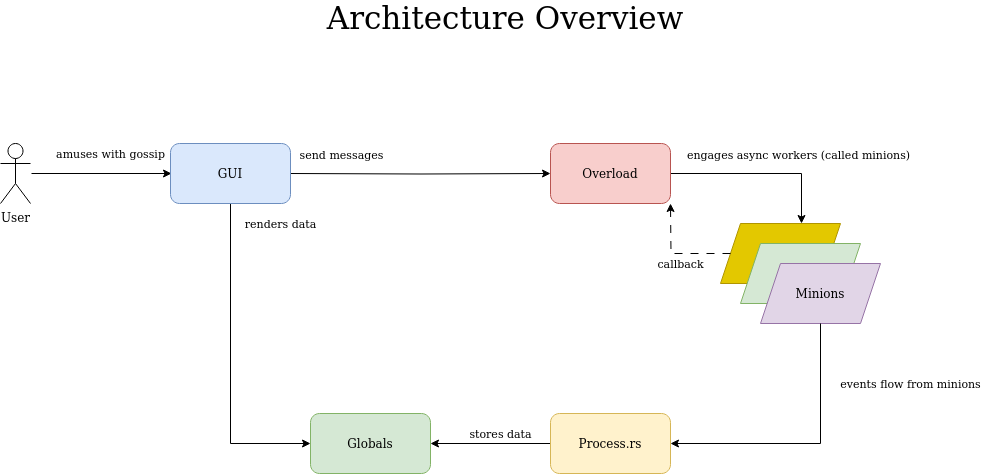

# Developing



Gossip is architected with the following components:

- A User Interface thread, synchronous
- Tokio asynchronous runtime running
  - An overlord: handles any operation that involves talking to relays, and a few more
  - A set of minions: each one contacts a proper relay to get data, composing the filter and sending it to the relay

## Keeping the UI responsive

The most important thing to be aware of is that the User Interface thread repeatedly calculates what to draw and potentially redraws up to 60 frames per second, therefore it **must** not run any slow code.

To that end, the following are allowed from the UI thread:

- Locking global variables (since nearly all locks in gossip are intended to be rapidly released)
- Sending messages to the overlord.

The following is NOT appreciated when done from the UI thread:

- Database calls, or calls to functions that do database calls
- Internet queries, or calls to functions that query over the Internet

Generally when you need to do something that takes a while, ask the overlord to do it for you.

You also must make sure that if you acquire a lock on a global in any code (UI or not), you **must release the lock very rapidly**. Do not hold such locks while doing database calls, and definitely do not hold them while waiting for the network. You may need to copy data to achieve this.

## Communication

Anyone can send a message to the Overlord using the GLOBALS.to_overlord channel.

The overlord generally is the one to send messages to minions using the GLOBALS.to_minions channel, but there may be cases for other components to talk directly to minions as well.

## Flow

The flow generally happens like this:

- The user interacts with the UI
- The UI requests something of the Overlord
- The overlord either does it, or spawns a task to do it if it takes too long (the overlord should also remain somewhat responsive).
- Sometimes the overlord has to start minions to handle it
- Sometimes the overlord contacts one or more minions
- The minions then updates filters on relays
- When events come in fulfilling those filters, they are sent to crate::process::process_new_event()
- crate::process handles the new event regardless of how it got there - generally it is unaware of the sequence of events that happened in the previous steps of this list
- the result of such processing updates global data
- the UI on the next frame reads the global data (which is now different) and renders accordingly.

## Changing Data Types

Many data types are so simple, or so well defined, that they will never change.  But others (such as Relay records) tend to get new fields, or have fields changed.

Whenever a data type that is stored in GLOBALS.storage changes, the stored data will no longer deserialize properly. Therefore, such data types must be versioned.  This extends into nostr-types data types as well.

The current convention is to add a V and a version number to the end of the type, such as EventV1 and EventV2. Some older versioned types do not include the 'V'.

Types used by the storage engine are defined in crate::storage::types.

The active currently-in-use type is the newest type and defined on a like like this

```rust
pub type PersonList = crate::storage::types::PersonList1;
```

Storage migrations need to reference the old type. Sometimes it is tempting to have a storage migration call into general code, passing a versioned type. But this is a very bad idea because at some time in the future that general code may be using a different version of that type. So you should ignore the DRY principle (don't repeat yourself) and actually copy the general code into the migration, being explicit about the version of the type.

## Pull Requests

Before issuing a Pull Request, please run and make pass:

````bash
cargo clippy
````

and then

````bash
cargo fmt
````

Avoid branches that have a lot of commits that are messed up, but happen to end up in a good state due to the last commit.  If you have a branch like this, create a new branch and one-by-one create a series of commits, each one a single logical step, each one compiling, each one passing clippy and rustfmt, each one documented, and each one doing something useful, such that this series of commits ends up where you originally got to (or somewhere even better). This not only makes it much easier to evaluate the PR, but it makes it possible to revert logical units later on if anything needs to be reverted, without necessarily reverting the entire branch.
